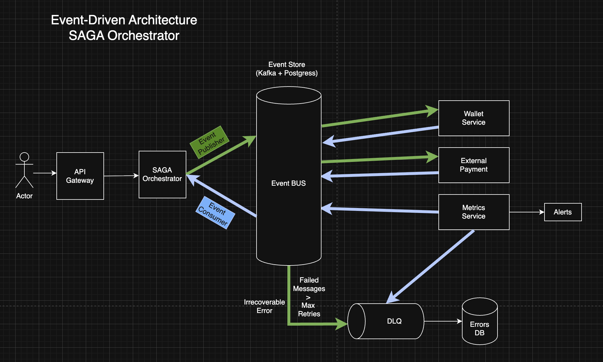

# Sistema de Pagos Event-Driven - Arquitectura del Sistema

## 1. Arquitectura de Alto Nivel con Event Sourcing

### Visión General

Arquitectura Event-Driven pura con **Event Store** como fuente de verdad y **SAGA Orchestrator** como coordinador central de workflows distribuidos. Todos los servicios son event consumers que procesan eventos y publican nuevos eventos al Event Store. El sistema implementa **Event Sourcing puro**, reconstruyendo el estado de las SAGAs desde eventos almacenados en el Event Store, sin necesidad de una base de datos de estado de SAGAs separada.

**Manejo de Errores:**

- **DLQ (Dead Letter Queue)**: Eventos que exceden el máximo de reintentos se envían al topic `events.dlq.v1`
- **DB Errors**: Persistencia permanente de errores críticos desde la DLQ para auditoría y análisis post-mortem



---

## 2. Componentes Principales

### 2.1 SAGA Orchestrator

**Responsabilidades:**

- **Iniciar SAGAs**: Crea workflows de pago cuando recibe solicitud
- **Orquestar Pasos**: Coordina secuencia de pasos de la SAGA
- **Gestionar Estado**: Mantiene estado de cada SAGA (state machine)
- **Compensación Automática**: Ejecuta compensaciones cuando detecta fallos
- **Timeout Handling**: Maneja timeouts y dispara compensaciones

**Estado de SAGA:**

- **Event Sourcing Puro**: El estado de la SAGA se reconstruye desde eventos almacenados en el Event Store cada vez que se necesita
- **No requiere SAGA State Store**: No hay tabla `sagas` separada; el estado se deriva de eventos

**No es responsable de:**

- Acceso directo a bases de datos de estado (todo vía eventos)
- Lógica de negocio específica (delegado a servicios)

**Estado de SAGA (State Machine):**

**Para Wallet Payments:**

```
INITIALIZED → VALIDATING_BALANCE → [COMPLETED | FAILED]
```

**Para External Payments:**

```
INITIALIZED → SENDING_TO_GATEWAY → SENT_TO_GATEWAY → AWAITING_RESPONSE →
[COMPLETED | FAILED]
```

### 2.2 Event Store

**Responsabilidades:**

- **Fuente de Verdad**: Todos los eventos se almacenan permanentemente
- **Event Streaming**: Redpanda (Kafka-compatible) para procesamiento en tiempo real
- **Event Persistence**: PostgreSQL para almacenamiento permanente
- **State Reconstruction**: Permite reconstruir estado desde eventos
- **Event Replay**: Capacidad de replay completo del sistema

**Dual Storage Strategy:**

1. **Event Bus (Streaming Layer) - Redpanda (Kafka-compatible)**

   - **MVP**: Redpanda - Kafka-compatible, más ligero para desarrollo local
   - **Producción**: Kafka real (mismo comportamiento, intercambiable)
   - Procesamiento en tiempo real
   - Retención: 7 días
   - **Particionamiento**: Topic `events.payments.v1` con 12 particiones
     - Particiones pares (0, 2, 4, 6, 8, 10): Wallet events (partition key: `user_id`)
     - Particiones impares (1, 3, 5, 7, 9, 11): External events (partition key: `payment_id`)
   - Consumer groups para escalado
   - Garantiza orden dentro de cada partición
   - Configuración: Broker `localhost:19092` (configurable via `KAFKA_BROKERS` env var)

2. **PostgreSQL (Event Store)**
   - Persistencia permanente (fuente de verdad)
   - Event sourcing completo
   - Reconstrucción de estado histórico
   - Soporte para snapshots (ver documento de mejoras futuras)

**Event Schema:**

```sql
CREATE TABLE events (
    event_id UUID PRIMARY KEY,
    aggregate_id VARCHAR(255) NOT NULL,
    aggregate_type VARCHAR(100) NOT NULL,
    event_type VARCHAR(100) NOT NULL,
    event_version INT NOT NULL,
    event_data JSONB NOT NULL,
    event_metadata JSONB,
    timestamp TIMESTAMP NOT NULL,
    sequence_number BIGSERIAL,
    kafka_offset BIGINT,
    kafka_partition INT,
    INDEX idx_aggregate (aggregate_id, sequence_number),
    INDEX idx_timestamp (timestamp),
    INDEX idx_kafka (kafka_partition, kafka_offset)
) PARTITION BY RANGE (timestamp);
```

### 2.3 Wallet Service

**Responsabilidades:**

- **Consumir Eventos**: Escucha `events.payments.v1` y filtra por `event.Type()` = "WalletPaymentRequested"
- **Procesar Lógica de Negocio**: Valida saldos, debita fondos directamente (ACID)
- **Publicar Eventos**: Publica eventos resultado (FundsDebited, FundsInsufficient) en `events.payments.v1`

### 2.4 External Payment Service

**Responsabilidades:**

- **Consumir Eventos**: Escucha `events.payments.v1` y filtra por `event.Type()` = "ExternalPaymentRequested"
- **Integración con Gateways**: Llama a pasarelas de pago externas
- **Publicar Respuestas**: Publica eventos (PaymentSentToGateway, PaymentGatewayResponse) en `events.payments.v1`
- **Manejo de Reintentos**: Implementa circuit breaker y retry logic para timeouts

### 2.5 Metrics Service

**Responsabilidades:**

- **Servicio Global de Monitoreo**: Monitorea todos los servicios del sistema
- **Consumir Eventos**: Escucha `events.payments.v1` y filtra por `event.Type()` para todos los tipos de eventos
- **Agregación en Tiempo Real**: Calcula métricas (tasas de éxito, latencias) por tipo de pago y servicio
- **Observabilidad Global**: Recolecta métricas, logs y trazabilidad de todos los servicios
- **DLQ Handling**: Procesa eventos de la DLQ (`events.dlq.v1`) y persiste errores críticos a DB Errors
- **Alertas**: Genera alertas basadas en umbrales y errores críticos
- **Health Monitoring**: Monitorea el estado de salud de todos los servicios

---

## 3. Flujos de Eventos - Dos Tipos de Pago Separados

### 3.1 Flujo de Pago con Billetera Propia (Wallet Payment)

```
1. Cliente → POST /api/payments/wallet {amount, user_id}
   ↓
2. SAGA Orchestrator → Event Store: WalletPaymentRequested Event
   ↓
3. Wallet Service consume WalletPaymentRequested (desde events.payments.v1, partición basada en user_id)
   → Rebuild wallet state from events (Event Sourcing puro)
   → Valida saldo disponible
   → Si suficiente: Publica FundsDebited event
   → Event Store: FundsDebited Event (topic: events.payments.v1, misma partición por user_id)
   ↓
4. SAGA Orchestrator consume FundsDebited (desde events.payments.v1, reconstruye estado de SAGA desde eventos)
   → Reconstruye SAGA desde Event Store usando paymentID
   → Aplica evento y determina transición: COMPLETED
   → Event Store: WalletPaymentCompleted Event (topic: events.payments.v1, misma partición por user_id)
   ↓
5. Metrics Service consume WalletPaymentCompleted (desde events.payments.v1)
   → Filtra por event.Type() = "WalletPaymentCompleted"
   → Registra métricas de éxito y observabilidad
   ↓
6. SAGA Orchestrator → Saga Finalized
```

**Características:**

- Estado reconstruido desde Event Store (Event Sourcing puro)
- Validación de balance desde eventos
- Rechazo inmediato si saldo insuficiente (FundsInsufficient event)
- Sin compensación necesaria (validación ocurre antes de cualquier operación irreversible)

### 3.2 Flujo de Pago Externo (External Payment - Tarjeta, etc.)

```
1. Cliente → POST /api/payments/creditcard {amount, card_token}
   ↓
2. SAGA Orchestrator → Event Store: ExternalPaymentRequested Event (topic: events.payments.v1)
   ↓
3. External Payment Service consume ExternalPaymentRequested (desde events.payments.v1)
   → Llama External Gateway (API call)
   → Event Store: PaymentSentToGateway Event (topic: events.payments.v1)
   ↓
4. SAGA Orchestrator consume PaymentSentToGateway (desde events.payments.v1)
   → Transición: AWAITING_RESPONSE
   ↓
5. External Gateway (webhook async) → Event Store: PaymentGatewayResponse Event (topic: events.payments.v1)
   ↓
6. SAGA Orchestrator consume PaymentGatewayResponse (desde events.payments.v1)
   → Evalúa resultado:
     - SUCCESS → Event Store: ExternalPaymentCompleted Event (topic: events.payments.v1)
     - FAILED/INSUFFICIENT_FUNDS/TIMEOUT → Event Store: ExternalPaymentFailed Event (topic: events.payments.v1)
   ↓
7. Metrics Service consume ExternalPaymentCompleted/ExternalPaymentFailed (desde events.payments.v1)
   → Filtra por event.Type()
   → Registra métricas
   ↓
8. Si falló después de max retries:
   → Evento enviado a DLQ (events.dlq.v1)
   → Metrics Service procesa DLQ y persiste a DB Errors (auditoría permanente)
   ↓
9. SAGA Orchestrator consume ExternalPaymentFailed (reconstruye estado de SAGA desde eventos)
   → Transición: FAILED
   → Saga Finalized
```

**Características:**

- Respuesta asíncrona del gateway externo
- Manejo de timeouts con reintentos exponenciales
- Si falla: DLQ + DB Errors (auditoría)

---

## 4. Event Sourcing - Reconstrucción de Estado

### 4.1 Reconstrucción de Estado desde Eventos

**Event Sourcing Puro**: El estado de las SAGAs y wallets se reconstruye completamente desde eventos cada vez que se necesita.

**Ejemplo: Reconstrucción de SAGA**

```go
func (o *Orchestrator) rebuildSagaFromEvents(ctx context.Context, sagaID, paymentID string) (*saga.Saga, error) {
    // 1. Load all events for this payment (paymentID is aggregateID)
    events, err := o.eventStore.LoadEvents(ctx, paymentID)
    if err != nil {
        return nil, err
    }

    // 2. Filter events by sagaID and rebuild
    saga := saga.NewSaga(sagaID, paymentID, userID, paymentType)
    for _, event := range events {
        // Extract sagaID from event data
        if eventData, ok := event.Data().(events.WalletPaymentRequestedData); ok {
            if eventData.SagaID == sagaID {
                if err := saga.ApplyEvent(event); err != nil {
                    return nil, err
                }
            }
        }
        // Apply other relevant events...
    }

    return saga, nil
}
```

**Ejemplo: Reconstrucción de Wallet**

```go
func (ws *WalletService) RebuildWalletState(userID string) (*Wallet, error) {
    // 1. Load all events for this wallet (userID is aggregateID)
    events := ws.eventStore.LoadEvents(ctx, userID)

    // 2. Apply events to rebuild state
    wallet := NewWallet(userID)
    for _, event := range events {
        wallet.ApplyEvent(event)
    }

    return wallet, nil
}
```

---

## 5. Integración con Sistemas Externos

### 5.1 Pasarelas de Pago Externas

**Pasarelas de Pago Externas**

```
External Payment Service
  ↓ HTTP REST API
External Gateway
  ↓ (asíncrono)
Webhook/Callback
  ↓
Event Store: PaymentGatewayResponse Event
```

### 5.2 Webhook Handler

**Servicio dedicado que:**

- Recibe webhooks de gateways externos
- Valida signatures
- Publica eventos al Event Store
- No contiene lógica de negocio (solo transformación)

---

## 6. Patrón SAGA - Orquestación de Workflows

### 6.1 SAGA Orchestration Pattern

**Orquestador Centralizado:**

- SAGA Orchestrator mantiene estado de cada SAGA
- Coordina pasos secuencialmente
- Maneja compensaciones automáticas
- Gestiona timeouts

### 6.2 Estados de SAGA

```go
type SagaState string

const (
    SagaInitialized      SagaState = "INITIALIZED"
    SagaLockingFunds     SagaState = "LOCKING_FUNDS"
    SagaFundsLocked      SagaState = "FUNDS_LOCKED"
    SagaSendingToGateway SagaState = "SENDING_TO_GATEWAY"
    SagaSentToGateway    SagaState = "SENT_TO_GATEWAY"
    SagaAwaitingResponse SagaState = "AWAITING_RESPONSE"
    SagaCompleted        SagaState = "COMPLETED"
    SagaFailed           SagaState = "FAILED"
    SagaCompensating     SagaState = "COMPENSATING"
    SagaCompensated      SagaState = "COMPENSATED"
)
```

### 6.3 Compensaciones Predefinidas

```go
type SagaStep struct {
    Name          string
    Action        func() error
    Compensation  func() error
    Timeout        time.Duration
}

var PaymentSagaSteps = []SagaStep{
    {
        Name:   "LockFunds",
        Action: lockFunds,
        Compensation: unlockFunds,
        Timeout: 5 * time.Second,
    },
    {
        Name:   "SendToGateway",
        Action: sendToGateway,
        Compensation: cancelGatewayPayment,
        Timeout: 30 * time.Second,
    },
}
```

---

## 7. Consideraciones de Seguridad

1. **Autenticación**: JWT tokens validados en API Gateway
2. **Autorización**: RBAC en SAGA Orchestrator
3. **Encriptación**: TLS in-flight, AES-256 at rest
4. **Event Validation**: Todos los eventos validados antes de almacenar
5. **Idempotency**: Eventos idempotentes mediante event_id

---

## 8. Consideraciones de Observabilidad

1. **Event Tracing**: Correlation IDs en todos los eventos
2. **SAGA Monitoring**: Estado de cada SAGA visible en dashboards
3. **Event Replay Metrics**: Tracking de eventos replayed
4. **Compensation Metrics**: Tracking de compensaciones ejecutadas

---

## 9. Ventajas de esta Arquitectura

1. **Event Sourcing**: Auditoría completa, replay, time-travel debugging
2. **SAGA Orchestration**: Manejo explícito de workflows complejos
3. **Desacoplamiento Total**: Servicios solo se comunican vía eventos
4. **Escalabilidad**: Cada servicio escala independientemente
5. **Resiliencia**: Replay automático desde Event Store
6. **Trazabilidad**: Historial completo de todas las operaciones
7. **Flexibilidad**: Agregar servicios sin cambiar existentes

---

---

## 10. Bases de Datos del Sistema

### 10.1 Event Store (PostgreSQL)

**Función**: Persistencia permanente de todos los eventos (fuente de verdad única)

**Schema**: `events` table con particionamiento por timestamp

### 10.2 DB Errors (PostgreSQL)

**Función**: Persistencia permanente de errores críticos desde la DLQ para auditoría y análisis post-mortem

**Schema**: `error_logs` table

**Acceso**: Metrics Service (write desde DLQ), servicios de monitoreo (read)

**Integración con DLQ**: El Metrics Service consume eventos de `events.dlq.v1` y los persiste permanentemente en esta base de datos.

---

## 11. Topics Simplificados (Redpanda/Kafka)

### 11.1 Nomenclatura Simplificada

**Topic Unificado:**

```
events.payments.v1    # Todos los eventos de pagos (wallet y external)
events.dlq.v1     # Dead Letter Queue
```

**Nota**: La separación por topics (`events.payments.wallet.v1` y `events.payments.external.v1`) se considera para el plan de escalabilidad horizontal futuro, pero para el MVP actual se usa un topic unificado.

### 11.2 Estrategia de Filtrado

Los consumers se subscriben a un topic y filtran por `event.Type()`:

```go
eventBus.Subscribe(ctx, "events.payments.v1", func(ctx context.Context, event events.Event) error {
    switch event.Type() {
    case "WalletPaymentRequested":
        return handleWalletPaymentRequested(ctx, event)
    case "FundsDebited":
        return handleFundsDebited(ctx, event)
    case "WalletPaymentCompleted":
        return handleWalletPaymentCompleted(ctx, event)
    case "ExternalPaymentRequested":
        return handleExternalPaymentRequested(ctx, event)
    case "PaymentSentToGateway":
        return handlePaymentSentToGateway(ctx, event)
    case "ExternalPaymentCompleted":
        return handleExternalPaymentCompleted(ctx, event)
    }
    return nil
})
```

### 11.3 Particionamiento Implementado

**Topic Único (`events.payments.v1`) con 12 Particiones:**

**Estrategia de Particionamiento:**

- **12 particiones totales**: 6 para wallet events + 6 para external events
- **Wallet Events** (particiones pares: 0, 2, 4, 6, 8, 10):
  - Partition key: `user_id`
  - Garantiza que todos los eventos de un mismo usuario van a la misma partición
  - Orden garantizado por usuario
- **External Events** (particiones impares: 1, 3, 5, 7, 9, 11):
  - Partition key: `payment_id`
  - Garantiza que todos los eventos de un mismo pago van a la misma partición
  - Orden garantizado por pago

**Beneficios:**

- ✅ Consistencia: Eventos relacionados siempre en la misma partición
- ✅ Orden: Garantizado dentro de cada partición
- ✅ Escalabilidad: Hasta 12 consumers paralelos (uno por partición)
- ✅ Separación de flujos: Wallet y external en particiones distintas

**Implementación:**

- Función `GetPartition()` en `internal/infrastructure/eventbus/partition_helper.go`
- EventBus implementado con Redpanda soporta particiones múltiples
- Cada evento se enruta a su partición correspondiente basado en `user_id` o `payment_id`

**Nota para Escalabilidad Futura:**

- Si se requiere mayor throughput, se puede aumentar el número de particiones
- En el plan de escalabilidad horizontal, se puede considerar separar en `events.payments.wallet.v1` y `events.payments.external.v1` para permitir particionamiento y escalado independiente por tipo de pago

---

Esta arquitectura implementa Event-Driven puro con SAGA Orchestrator y **Event Sourcing puro** como pilares fundamentales, proporcionando una base sólida, escalable y resiliente para el sistema de pagos.

**Características Clave:**

- ✅ **Event Sourcing Puro**: Estado de SAGAs reconstruido desde Event Store (sin SAGA State Store)
- ✅ **Topic Particionado**: `events.payments.v1` con 12 particiones para garantizar orden y consistencia
- ✅ **Metrics Service Global**: Monitoreo centralizado de todos los servicios
- ✅ **DLQ Integration**: Errores críticos persistidos en DB Errors para auditoría
