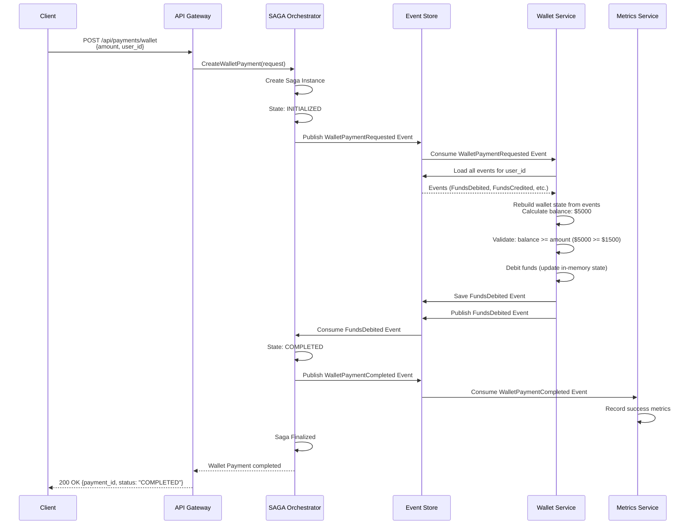
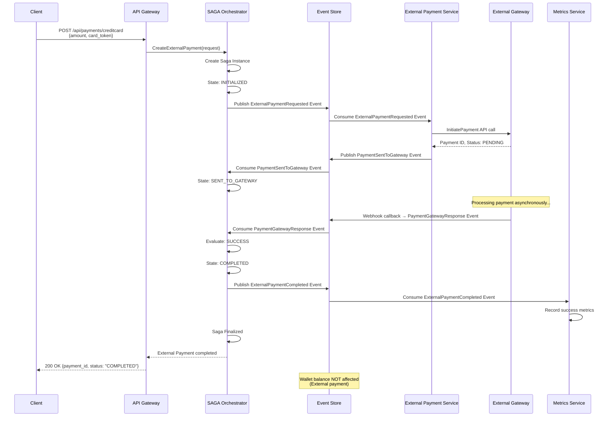

# Flujos de Pago - Happy Path

## Dos Flujos Separados

Este documento muestra los dos tipos de pagos completamente independientes:

1. **Pago con Billetera Propia**: Reconstruye balance desde eventos (Event Sourcing puro) y valida/debita
2. **Pago Externo**: Pagos con tarjeta/externos (NO afecta wallet del usuario)

---

## Flujo 1: Pago con Billetera Propia (Wallet Payment)

### Diagrama de Secuencia



### Estados de SAGA (Wallet Payment)

```
INITIALIZED
    ↓ (WalletPaymentRequested published)
VALIDATING_BALANCE
    ↓ (FundsDebited event received)
COMPLETED
    ↓
FINALIZED
```

---

## Flujo 2: Pago Externo (External Payment - Tarjeta, etc.)

### Diagrama de Secuencia



### Estados de SAGA (External Payment)

```
INITIALIZED
    ↓ (ExternalPaymentRequested published)
SENDING_TO_GATEWAY
    ↓ (PaymentSentToGateway event received)
SENT_TO_GATEWAY
    ↓ (waiting for gateway response)
AWAITING_RESPONSE
    ↓ (PaymentGatewayResponse received)
COMPLETED or FAILED
    ↓
FINALIZED
```

**IMPORTANTE**: Para pagos externos, NO se afecta el balance del wallet del usuario (el gateway externo maneja sus propias validaciones).

---

## Eventos por Tipo de Pago

### WalletPaymentRequested Event

**Topic:** `events.payments.v1`

```json
{
  "event_id": "evt_001",
  "event_type": "WalletPaymentRequested",
  "aggregate_id": "pay_xyz789",
  "event_version": 1,
  "timestamp": "2024-01-15T10:30:00Z",
  "sequence_number": 1001,
  "data": {
    "payment_id": "pay_xyz789",
    "saga_id": "saga_123",
    "user_id": "user_123",
    "service_id": "svc_456",
    "amount": 1500.0,
    "currency": "USD",
    "idempotency_key": "idemp_key_abc123",
    "metadata": {}
  }
}
```

### Eventos Específicos de Wallet Payment

```json
// FundsDebited
{
  "event_id": "evt_002",
  "event_type": "FundsDebited",
  "aggregate_id": "user_123",
  "event_version": 1,
  "timestamp": "2024-01-15T10:30:05Z",
  "sequence_number": 1002,
  "data": {
    "payment_id": "pay_xyz789",
    "user_id": "user_123",
    "amount": 1500.0,
    "previous_balance": 5000.0,
    "new_balance": 3500.0,
    "payment_type": "wallet"
  }
}

// WalletPaymentCompleted
{
  "event_id": "evt_003",
  "event_type": "WalletPaymentCompleted",
  "aggregate_id": "pay_xyz789",
  "event_version": 1,
  "timestamp": "2024-01-15T10:30:10Z",
  "sequence_number": 1003,
  "data": {
    "payment_id": "pay_xyz789",
    "saga_id": "saga_123",
    "user_id": "user_123",
    "amount": 1500.0,
    "currency": "USD",
    "completed_at": "2024-01-15T10:30:10Z",
    "gateway_provider": "wallet"
  }
}
```

### Eventos Específicos de External Payment

**Topic:** `events.payments.v1`

```json
// ExternalPaymentRequested
{
  "event_id": "evt_004",
  "event_type": "ExternalPaymentRequested",
  "aggregate_id": "pay_abc999",
  "event_version": 1,
  "timestamp": "2024-01-15T10:30:00Z",
  "sequence_number": 1004,
  "data": {
    "payment_id": "pay_abc999",
    "saga_id": "saga_456",
    "user_id": "user_123",
    "service_id": "svc_789",
    "amount": 2000.0,
    "currency": "USD",
    "card_token": "card_token_xyz",
    "idempotency_key": "idemp_key_def456",
    "metadata": {}
  }
}

// PaymentSentToGateway
{
  "event_id": "evt_005",
  "event_type": "PaymentSentToGateway",
  "aggregate_id": "pay_abc999",
  "event_version": 1,
  "timestamp": "2024-01-15T10:30:10Z",
  "sequence_number": 1005,
  "data": {
    "payment_id": "pay_abc999",
    "saga_id": "saga_456",
    "gateway_provider": "external",
    "gateway_payment_id": "ext_txn_123",
    "sent_at": "2024-01-15T10:30:10Z"
  }
}

// PaymentGatewayResponse
{
  "event_id": "evt_006",
  "event_type": "PaymentGatewayResponse",
  "aggregate_id": "pay_abc999",
  "event_version": 1,
  "timestamp": "2024-01-15T10:31:20Z",
  "sequence_number": 1006,
  "data": {
    "payment_id": "pay_abc999",
    "saga_id": "saga_456",
    "gateway_provider": "external",
    "status": "SUCCESS",  // o "FAILED", "INSUFFICIENT_FUNDS", "TIMEOUT"
    "transaction_id": "txn_ext_456",
    "response_data": {},
    "responded_at": "2024-01-15T10:31:20Z"
  }
}

// ExternalPaymentCompleted
{
  "event_id": "evt_007",
  "event_type": "ExternalPaymentCompleted",
  "aggregate_id": "pay_abc999",
  "event_version": 1,
  "timestamp": "2024-01-15T10:31:25Z",
  "sequence_number": 1007,
  "data": {
    "payment_id": "pay_abc999",
    "saga_id": "saga_456",
    "user_id": "user_123",
    "amount": 2000.0,
    "currency": "USD",
    "completed_at": "2024-01-15T10:31:25Z",
    "gateway_provider": "external",
    "transaction_id": "txn_ext_456"
  }
}
```

---

## SAGA Orchestrator - Métodos Separados

### CreateWalletPayment

```go
func (o *Orchestrator) CreateWalletPayment(ctx context.Context, req CreateWalletPaymentRequest) (*PaymentResponse, error) {
    // Create saga with payment type "wallet"
    s := saga.NewSaga(sagaID, paymentID, req.UserID, "wallet")

    // Publish WalletPaymentRequested event
    event := events.NewWalletPaymentRequested(...)

	topic := "events.payments.v1"
	eventBus.Publish(ctx, topic, event)
}
```

### CreateExternalPayment

```go
func (o *Orchestrator) CreateExternalPayment(ctx context.Context, req CreateExternalPaymentRequest) (*PaymentResponse, error) {
    // Create saga with payment type "external"
    s := saga.NewSaga(sagaID, paymentID, req.UserID, "external")

    // Publish ExternalPaymentRequested event
    event := events.NewExternalPaymentRequested(..., req.CardToken, ...)

	topic := "events.payments.v1"
	eventBus.Publish(ctx, topic, event)
}
```

### ProcessEvent - Handlers Específicos

```go
func (o *Orchestrator) ProcessEvent(ctx context.Context, event events.Event) error {
    switch event.Type() {
    case "WalletPaymentRequested":
        return o.handleWalletPaymentRequested(ctx, event)
    case "ExternalPaymentRequested":
        return o.handleExternalPaymentRequested(ctx, event)
    case "FundsDebited":
        return o.handleFundsDebited(ctx, event)
    case "FundsInsufficient":
        return o.handleFundsInsufficient(ctx, event)
    case "PaymentSentToGateway":
        return o.handlePaymentSentToGateway(ctx, event)
    case "PaymentGatewayResponse":
        return o.handlePaymentGatewayResponse(ctx, event)
    }
}
```

---

## Consideraciones Importantes

### 1. Wallet Payment con Event Sourcing

- Reconstruye balance desde eventos (Event Sourcing puro)
- Valida saldo disponible desde estado reconstruido
- Publica evento FundsDebited si saldo suficiente
- Fallo inmediato si saldo insuficiente (publica FundsInsufficient)
- Endpoint específico: `POST /api/payments/wallet`

### 2. External Payment es Asíncrono

- NO afecta el wallet del usuario en ningún momento
- Respuesta asíncrona de gateway externo
- Manejo de timeouts y reintentos en External Payment Service
- Endpoint específico: `POST /api/payments/creditcard`
- Requiere `card_token` en el request

### 3. Sin Compensación para External Payments

- Si falla, simplemente se publica ExternalPaymentFailed
- No hay fondos bloqueados que liberar
- Gateway externo maneja su propia reversión si es necesario

---
