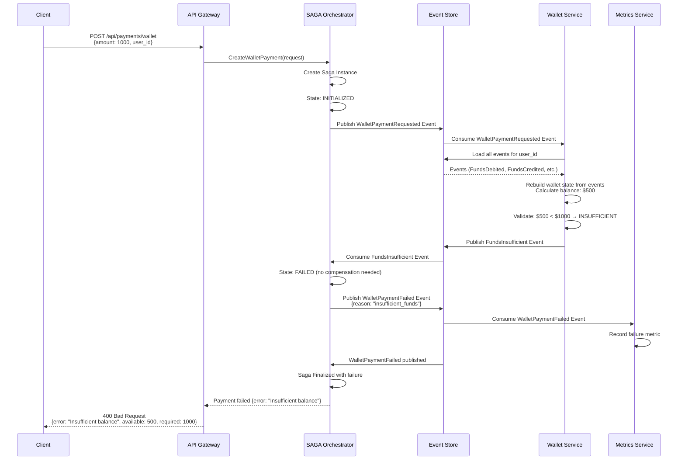

# Flujo de Pago - Saldo Insuficiente

## Rechazo Rápido para Pagos con Billetera Propia

Este flujo muestra cómo el sistema maneja rechazos por saldo insuficiente **SOLO para pagos con billetera propia**. El balance se reconstruye desde eventos (Event Sourcing puro) y se valida antes de procesar. Los pagos externos no validan saldo del wallet (el gateway externo maneja sus propias validaciones).

---

## Diagrama de Secuencia



---

## Eventos Publicados en Orden

### 1. WalletPaymentRequested Event

**Topic:** `events.payments.v1`

```json
{
  "event_id": "evt_001",
  "event_type": "WalletPaymentRequested",
  "aggregate_id": "pay_abc999",
  "event_version": 1,
  "timestamp": "2024-01-15T10:30:00Z",
  "sequence_number": 2001,
  "data": {
    "payment_id": "pay_abc999",
    "saga_id": "saga_456",
    "user_id": "user_456",
    "service_id": "svc_789",
    "amount": 1000.0,
    "currency": "USD",
    "idempotency_key": "idemp_key_xyz"
  }
}
```

### 2. FundsInsufficient Event

**Topic:** `events.payments.v1`

```json
{
  "event_id": "evt_002",
  "event_type": "FundsInsufficient",
  "aggregate_id": "user_456",
  "aggregate_type": "Wallet",
  "event_version": 1,
  "timestamp": "2024-01-15T10:30:02Z",
  "sequence_number": 2002,
  "data": {
    "payment_id": "pay_abc999",
    "user_id": "user_456",
    "requested_amount": 1000.0,
    "available_balance": 500.0,
    "payment_type": "wallet"
  }
}
```

### 3. WalletPaymentFailed Event

**Topic:** `events.payments.v1`

```json
{
  "event_id": "evt_003",
  "event_type": "WalletPaymentFailed",
  "aggregate_id": "pay_abc999",
  "aggregate_type": "Payment",
  "event_version": 1,
  "timestamp": "2024-01-15T10:30:03Z",
  "sequence_number": 2003,
  "data": {
    "payment_id": "pay_abc999",
    "saga_id": "saga_456",
    "user_id": "user_456",
    "amount": 1000.0,
    "currency": "USD",
    "reason": "insufficient_funds",
    "failed_at": "2024-01-15T10:30:03Z"
  }
}
```

---

## Estados de la SAGA

```
INITIALIZED
    ↓ (WalletPaymentRequested published)
VALIDATING_BALANCE
    ↓ (FundsInsufficient event received)
FAILED
    ↓ (WalletPaymentFailed published)
FINALIZED
```

---
