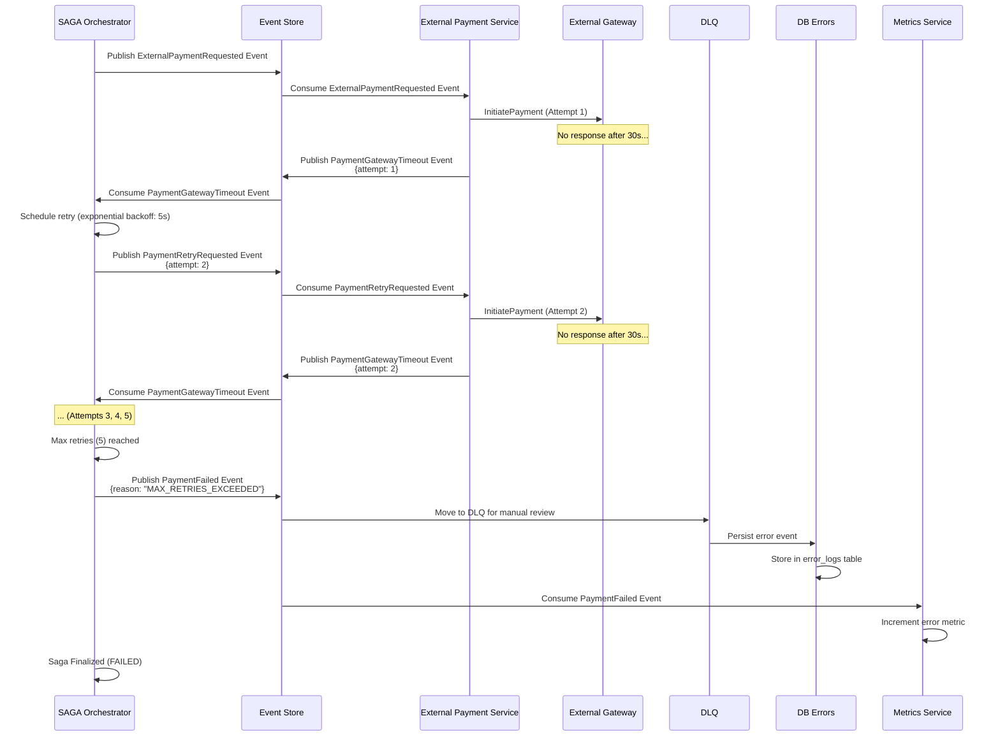

# Flujo de Pago Externo - Gateway Timeout con Reintentos y DLQ

## Arquitectura Event-Driven: Manejo de Timeouts Solo para Pagos Externos

Este flujo muestra cómo se manejan timeouts en pagos externos (NO afecta el wallet del usuario). Incluye reintentos exponenciales y, si falla, envío a DLQ y registro en DB Errors.

---

## Diagrama de Secuencia: Timeout y Reintentos



---

## Estrategia de Reintentos con Exponential Backoff

### Configuración de External Payment Service

```yaml
retry_policy:
  external_payments:
    max_attempts: 5
    initial_delay: 5s
    max_delay: 60s
    multiplier: 2
    jitter: true
```

### Secuencia de Reintentos

```
Attempt 1: Immediate
  ↓ Timeout after 30s

Attempt 2: Wait 5s (exponential backoff)
  ↓ Timeout after 30s

Attempt 3: Wait 10s
  ↓ Timeout after 30s

Attempt 4: Wait 20s
  ↓ Timeout after 30s

Attempt 5: Wait 40s
  ↓ Timeout after 30s

Max retries reached → PaymentFailed → DLQ → DB Errors
```

---

## Eventos de Timeout y Reintento

### PaymentGatewayTimeout Event

```json
{
  "event_id": "evt_timeout_001",
  "event_type": "PaymentGatewayTimeout",
  "aggregate_id": "pay_xyz789",
  "event_version": 1,
  "timestamp": "2024-01-15T10:30:45Z",
  "sequence_number": 3001,
  "data": {
    "payment_id": "pay_xyz789",
    "saga_id": "saga_123",
    "gateway_provider": "external",
    "payment_type": "external",
    "attempt": 1,
    "max_attempts": 5,
    "timeout_duration_seconds": 30,
    "timeout_at": "2024-01-15T10:30:45Z"
  }
}
```

### PaymentRetryRequested Event

```json
{
  "event_id": "evt_retry_001",
  "event_type": "PaymentRetryRequested",
  "aggregate_id": "pay_xyz789",
  "event_version": 1,
  "timestamp": "2024-01-15T10:30:50Z",
  "sequence_number": 3002,
  "data": {
    "payment_id": "pay_xyz789",
    "saga_id": "saga_123",
    "payment_type": "external",
    "attempt": 2,
    "previous_attempt": 1,
    "previous_error": "TIMEOUT",
    "next_retry_at": "2024-01-15T10:30:50Z"
  }
}
```

### PaymentFailed Event (Max Retries Exceeded)

```json
{
  "event_id": "evt_failed_001",
  "event_type": "PaymentFailed",
  "aggregate_id": "pay_xyz789",
  "aggregate_type": "Payment",
  "event_version": 1,
  "timestamp": "2024-01-15T10:32:15Z",
  "sequence_number": 3006,
  "data": {
    "payment_id": "pay_xyz789",
    "saga_id": "saga_123",
    "payment_type": "external",
    "reason": "MAX_RETRIES_EXCEEDED",
    "failed_at": "2024-01-15T10:32:15Z",
    "retry_history": [
      { "attempt": 1, "error": "TIMEOUT", "timestamp": "2024-01-15T10:30:45Z" },
      { "attempt": 2, "error": "TIMEOUT", "timestamp": "2024-01-15T10:31:20Z" },
      { "attempt": 3, "error": "TIMEOUT", "timestamp": "2024-01-15T10:31:50Z" },
      { "attempt": 4, "error": "TIMEOUT", "timestamp": "2024-01-15T10:32:10Z" },
      { "attempt": 5, "error": "TIMEOUT", "timestamp": "2024-01-15T10:32:15Z" }
    ],
    "compensation_required": false
  }
}
```

---

## Flujo a DLQ y DB Errors

### DLQ Event Structure

```json
{
  "dlq_event_id": "dlq_001",
  "original_event": {
    "event_id": "evt_failed_001",
    "event_type": "PaymentFailed",
    "data": {
      "payment_id": "pay_xyz789",
      "reason": "MAX_RETRIES_EXCEEDED",
      "payment_type": "external"
    }
  },
  "failure_reason": "MAX_RETRIES_EXCEEDED",
  "failure_count": 5,
  "first_failure_at": "2024-01-15T10:30:45Z",
  "last_attempt_at": "2024-01-15T10:32:15Z",
  "consumer_group": "external-payment-service-group",
  "original_topic": "payment.events.failed.v1",
  "original_partition": 2,
  "original_offset": 12345
}
```

### DB Errors - Persistence

```sql
CREATE TABLE error_logs (
    error_id UUID PRIMARY KEY,
    payment_id VARCHAR(255),
    saga_id VARCHAR(255),
    error_type VARCHAR(100),
    error_reason TEXT,
    original_event JSONB,
    retry_history JSONB,
    first_occurred_at TIMESTAMP,
    last_occurred_at TIMESTAMP,
    resolved BOOLEAN DEFAULT FALSE,
    resolved_at TIMESTAMP,
    created_at TIMESTAMP NOT NULL DEFAULT NOW(),
    INDEX idx_payment_id (payment_id),
    INDEX idx_unresolved (resolved, created_at)
);
```

### Persistencia en DB Errors

```go
func (dbe *DBErrorsService) PersistErrorEvent(event PaymentFailedEvent) error {
    errorLog := ErrorLog{
        ErrorID:        uuid.New(),
        PaymentID:      event.Data.PaymentID,
        SagaID:         event.Data.SagaID,
        ErrorType:      "TIMEOUT_MAX_RETRIES",
        ErrorReason:    event.Data.Reason,
        OriginalEvent: event,
        RetryHistory:     event.Data.RetryHistory,
        FirstOccurredAt: event.Data.RetryHistory[0].Timestamp,
        LastOccurredAt: event.Data.FailedAt,
        Resolved:       false,
    }

    return dbe.db.Insert("error_logs", errorLog)
}
```

---

## External Payment Service - Lógica de Reintentos

```go
func (eps *ExternalPaymentService) ProcessWithRetry(paymentID string) error {
    policy := RetryPolicy{
        MaxAttempts:  5,
        InitialDelay: 5 * time.Second,
        MaxDelay:     60 * time.Second,
        Multiplier:   2.0,
        Jitter:       true,
    }

    attempt := 0
    delay := policy.InitialDelay

    for attempt < policy.MaxAttempts {
        if err := eps.sendToGateway(paymentID); err == nil {
            // Success
            return nil
        }

        attempt++

        // Check if timeout error
        if !isTimeout(err) {
            // Non-timeout error - fail immediately
            eps.eventStore.Publish(PaymentFailedEvent{
                PaymentID: paymentID,
                PaymentType: "external",
                Reason:    err.Error(),
            })
            return err
        }

        if attempt < policy.MaxAttempts {
            // Publish timeout event
            eps.eventStore.Publish(PaymentGatewayTimeoutEvent{
                PaymentID:  paymentID,
                Attempt:    attempt,
                MaxAttempts: policy.MaxAttempts,
            })

            // Wait before retry
            time.Sleep(delay)

            // Exponential backoff
            delay = time.Duration(float64(delay) * policy.Multiplier)
            if delay > policy.MaxDelay {
                delay = policy.MaxDelay
            }

            // Jitter
            if policy.Jitter {
                jitter := time.Duration(rand.Intn(int(delay / 10)))
                delay += jitter
            }
        }
    }

    // Max attempts reached - publish failure event
    eps.eventStore.Publish(PaymentFailedEvent{
        PaymentID: paymentID,
        PaymentType: "external",
        Reason:    "MAX_RETRIES_EXCEEDED",
        RetryHistory: eps.getRetryHistory(paymentID),
    })

    // Route to DLQ
    eps.routeToDLQ(paymentID, "MAX_RETRIES_EXCEEDED")

    // Increment error metric
    eps.metricsService.IncrementErrorMetric("external_payment_timeout")

    return ErrMaxRetriesExceeded
}
```

---

## Estados de la SAGA con Timeout (External Payment)

```
INITIALIZED
    ↓
SENDING_TO_GATEWAY
    ↓
SENT_TO_GATEWAY
    ↓
AWAITING_RESPONSE
    ↓ (Timeout on attempt 1)
RETRYING (attempt 2)
    ↓ (Timeout on attempt 2)
RETRYING (attempt 3)
    ↓ (Timeout on attempt 3)
RETRYING (attempt 4)
    ↓ (Timeout on attempt 4)
RETRYING (attempt 5)
    ↓ (Timeout on attempt 5)
FAILED (MAX_RETRIES_EXCEEDED)
    ↓ (DLQ + DB Errors)
FINALIZED
```

**IMPORTANTE**: NO hay compensación porque NO se afectó el wallet del usuario (pago externo).

---
