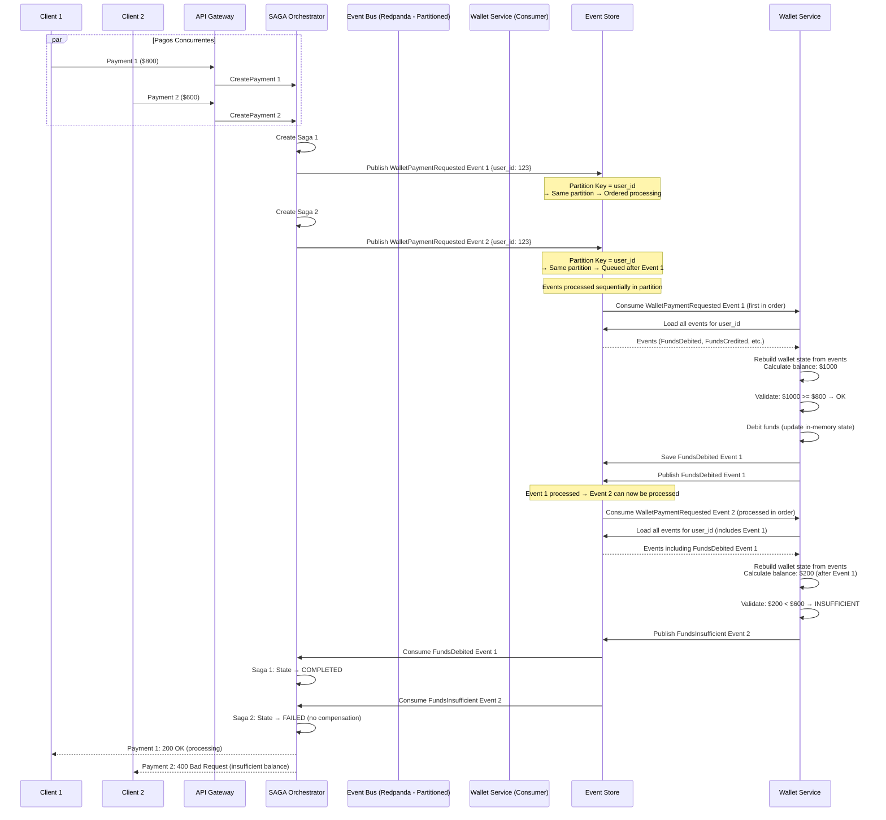

# Flujo de Pago - Pagos Concurrentes con Event Sourcing (Solo Wallet Payments)

## Prevención de Race Conditions con Event Sourcing

Este flujo muestra cómo Event Sourcing y el ordenamiento de eventos previenen condiciones de carrera cuando múltiples pagos con billetera propia intentan modificar el mismo saldo simultáneamente.

---

## Problema: Race Condition en Pagos Concurrentes con Billetera Propia

### Escenario

Usuario intenta 2 pagos simultáneos usando billetera propia:

- Pago 1: $800 (payment_type: "wallet")
- Pago 2: $600 (payment_type: "wallet")
- Saldo disponible: $1000

Sin control, ambos podrían pasar validación y crear condición de carrera al modificar el balance del usuario.

---

## Solución: Event Sourcing con Particionamiento y Ordenamiento

### Diagrama de Secuencia



---

## Event Sourcing - Orden Garantizado

### Particionamiento por Aggregate ID

```go
// Event Bus Producer - Partition by user_id
// Usa API de Kafka (compatible con Redpanda y Kafka real)
func publishPaymentRequested(event PaymentRequestedEvent) error {
    partitionKey := []byte(event.Data.UserID) // user_id

    producer.Send(&kafka.Message{
        Topic:     "events.payments.v1",
        Key:       partitionKey, // Same user → same partition
        Value:     eventJSON,
        Partition: hash(partitionKey) % numPartitions,
    })
}
```

**Garantía**: Todos los eventos de un mismo `user_id` van a la misma partición y se procesan en orden.

---

## Reconstrucción de Estado desde Eventos

### Wallet Service - Rebuild State

```go
func (ws *WalletService) ProcessPaymentRequested(event PaymentRequestedEvent) error {
    userID := event.Data.UserID

    // 1. Rebuild current state from events
    wallet := ws.rebuildWalletFromEvents(userID)

    // 2. Validate with current state
    if wallet.AvailableBalance < event.Data.Amount {
        // Insufficient - publish rejection event
        ws.eventStore.Publish(FundsInsufficientEvent{
            PaymentID:      event.Data.PaymentID,
            UserID:         userID,
            RequestedAmount: event.Data.Amount,
            AvailableBalance: wallet.AvailableBalance,
        })
        return nil
    }

    // 3. Debit funds directly (ACID transaction)
    wallet.Balance -= event.Data.Amount
    wallet.AvailableBalance -= event.Data.Amount

    // 4. Save event to Event Store (persistente)
    ws.eventStore.SaveEvent(FundsDebitedEvent{...})

    // 5. Publish event (event sourcing)
    ws.eventStore.Publish(FundsDebitedEvent{
        PaymentID:      event.Data.PaymentID,
        UserID:         userID,
        Amount:         event.Data.Amount,
        LockedBalance:  wallet.LockedBalance,
        AvailableBalance: wallet.AvailableBalance,
    })

    return nil
}

func (ws *WalletService) rebuildWalletFromEvents(userID string) (*Wallet, error) {
    // Load snapshot if available
    snapshot := ws.loadSnapshot(userID)

    // Load events since snapshot
    events := ws.eventStore.LoadEventsSince(userID, snapshot.LastEventSequence)

    // Apply events to rebuild state
    wallet := snapshot.State
    for _, event := range events {
        wallet.ApplyEvent(event)
    }

    return wallet, nil
}
```

---

## Eventos y Orden de Procesamiento

### Timeline de Eventos

```
T0: PaymentRequested Event 1 (Payment $800)
    → Partition 2 (user_id hash)
    → Sequence: 4001

T1: PaymentRequested Event 2 (Payment $600)
    → Partition 2 (same user_id)
    → Sequence: 4002

T2: Wallet Service procesa Event 1
    → Rebuild state: Balance $1000
    → Lock $800
    → Publish FundsLocked Event 1
    → Sequence: 4003

T3: Wallet Service procesa Event 2
    → Rebuild state: Balance $200 (after Event 1)
    → Validate: $200 < $600 → Reject
    → Publish FundsInsufficient Event 2
    → Sequence: 4004
```

---

## Prevención de Race Conditions

### Múltiples Capas de Protección

1. **Particionamiento del Event Bus (Redpanda)**

   - Eventos del mismo usuario → misma partición → orden garantizado

2. **Rebuild State desde Eventos**

   - Estado se reconstruye desde eventos (fuente de verdad)
   - Estado siempre derivado de eventos (fuente de verdad inmutable)

3. **Serialización por Partición**

   - Redpanda (Kafka-compatible) procesa una partición secuencialmente
   - Consumer procesa eventos en orden

---

## Event Sourcing

```go
// No lock necesario - orden garantizado por partición
events := eventStore.LoadEvents(userID)
wallet := rebuildState(events) // Estado actual desde eventos
if wallet.AvailableBalance >= amount {
    eventStore.Publish(FundsLockedEvent{...}) // Evento inmutable
}
```

**Ventajas:**

- ✅ No requiere locks distribuidos
- ✅ Escalable (múltiples usuarios en paralelo)
- ✅ Historial completo
- ✅ Replay para debugging

---

## Ventajas del Enfoque Event Sourcing

1. **Orden Garantizado**: Particionamiento garantiza orden para mismo usuario
2. **Sin Locks**: No requiere locks distribuidos
3. **Estado Consistente**: Estado siempre derivado de eventos (fuente de verdad)
4. **Escalabilidad**: Múltiples usuarios procesados en paralelo (diferentes particiones)
5. **Debugging**: Historial completo permite análisis post-mortem
6. **Time-Travel**: Puede recrear estado en cualquier punto temporal

---
