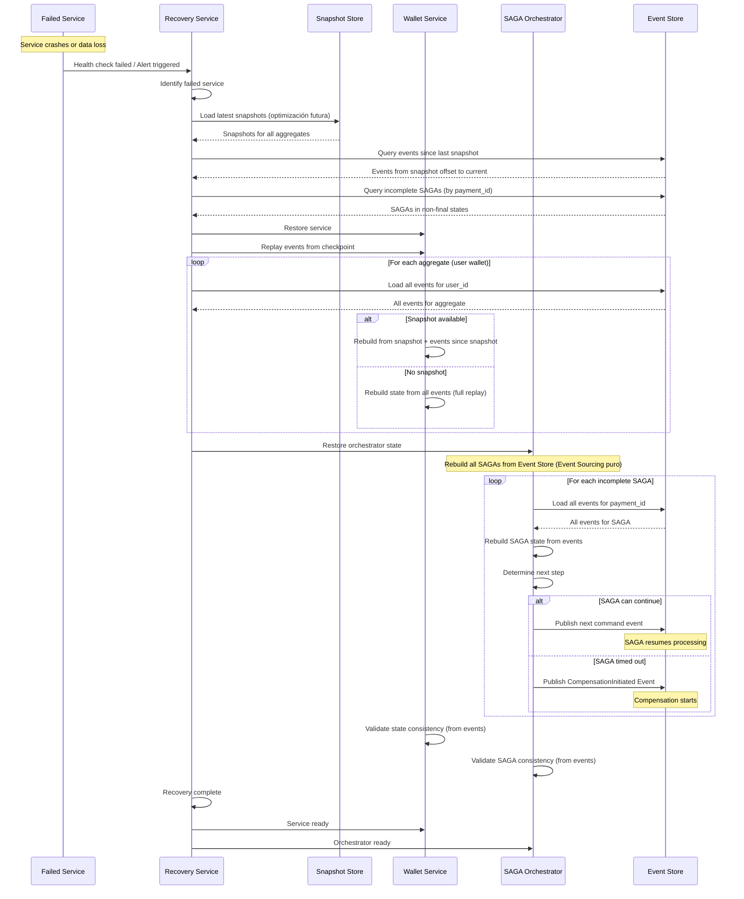

# Flujo de Recuperación - Event Sourcing Replay

## Recuperación Completa desde Event Store

Este flujo muestra cómo el sistema se recupera completamente desde el Event Store usando Event Sourcing, reconstruyendo estado de todos los agregados y continuando procesamiento donde se detuvo.

---

## Diagrama de Secuencia: Recuperación Completa



---

## Estrategia de Checkpointing y Snapshots

### Snapshot Structure

```json
{
  "snapshot_id": "snapshot-2024-01-15-10-00",
  "aggregate_id": "user_123",
  "aggregate_type": "Wallet",
  "timestamp": "2024-01-15T10:00:00Z",
  "last_event_version": 5,
  "last_event_sequence": 10005,
  "state": {
    "balance": 5000.0,
    "locked_balance": 1500.0,
    "available_balance": 3500.0,
    "version": 5
  }
}
```

### Snapshot Storage Schema

```sql
CREATE TABLE snapshots (
    snapshot_id VARCHAR(255) PRIMARY KEY,
    aggregate_id VARCHAR(255) NOT NULL,
    aggregate_type VARCHAR(100) NOT NULL,
    snapshot_data JSONB NOT NULL,
    last_event_version INT NOT NULL,
    last_event_sequence BIGINT NOT NULL,
    created_at TIMESTAMP NOT NULL,
    INDEX idx_aggregate (aggregate_id, created_at),
    INDEX idx_type_created (aggregate_type, created_at)
);
```

---

## Proceso de Replay Completo

### 1. Identificar Punto de Recuperación

```go
func (rs *RecoveryService) IdentifyRecoveryPoint(serviceID string) (*RecoveryPoint, error) {
    // Load latest checkpoint for service
    checkpoint := rs.loadCheckpoint(serviceID)

    if checkpoint == nil {
        // First recovery - load all events
        return &RecoveryPoint{
            LastEventSequence: 0,
            LastSnapshotID:    "",
        }, nil
    }

    return checkpoint, nil
}
```

### 2. Cargar Snapshots

```go
func (rs *RecoveryService) LoadSnapshots() (map[string]*Snapshot, error) {
    // Load all recent snapshots
    snapshots := rs.snapshotStore.LoadRecentSnapshots(24 * time.Hour)

    snapshotMap := make(map[string]*Snapshot)
    for _, snapshot := range snapshots {
        snapshotMap[snapshot.AggregateID] = snapshot
    }

    return snapshotMap, nil
}
```

### 3. Replay Eventos desde Snapshot

```go
func (rs *RecoveryService) ReplayEvents(snapshot *Snapshot) error {
    // Load events since snapshot
    events := rs.eventStore.LoadEventsSince(
        aggregateID: snapshot.AggregateID,
        since: snapshot.LastEventSequence,
    )

    // Rebuild state
    state := snapshot.State
    for _, event := range events {
        state.ApplyEvent(event)
    }

    // Update projection
    return rs.updateProjection(snapshot.AggregateID, state)
}
```

### 4. Reconstruir SAGAs

```go
func (rs *RecoveryService) RecoverSAGAs() error {
    // Find incomplete SAGAs
    incompleteSAGAs := rs.findIncompleteSAGAs()

    for _, sagaID := range incompleteSAGAs {
        // Rebuild SAGA state from events
        saga := rs.rebuildSagaFromEvents(sagaID)

        // Determine if SAGA should continue or compensate
        if rs.shouldCompensate(saga) {
            rs.initiateCompensation(saga)
        } else {
            rs.resumeSaga(saga)
        }
    }

    return nil
}

func (rs *RecoveryService) rebuildSagaFromEvents(sagaID string) (*PaymentSaga, error) {
    // Load all events for this SAGA
    events := rs.eventStore.LoadEvents(sagaID)

    saga := NewPaymentSaga(sagaID)
    for _, event := range events {
        saga.ApplyEvent(event)
    }

    return saga, nil
}
```

---

## Event Replay Strategies

### 1. Full Replay (Slow but Complete)

```go
func (rs *RecoveryService) FullReplay(aggregateID string) error {
    // Load ALL events for aggregate
    events := rs.eventStore.LoadAllEvents(aggregateID)

    // Rebuild state from scratch
    state := NewEmptyState()
    for _, event := range events {
        state.ApplyEvent(event)
    }

    return rs.updateProjection(aggregateID, state)
}
```

### 2. Snapshot + Incremental (Fast)

```go
func (rs *RecoveryService) IncrementalReplay(aggregateID string) error {
    // Load snapshot
    snapshot := rs.loadSnapshot(aggregateID)

    // Load only events since snapshot
    events := rs.eventStore.LoadEventsSince(aggregateID, snapshot.LastEventSequence)

    // Rebuild from snapshot
    state := snapshot.State
    for _, event := range events {
        state.ApplyEvent(event)
    }

    return rs.updateProjection(aggregateID, state)
}
```

---

## Ventajas del Enfoque Event Sourcing para Recuperación

1. **Reconstrucción Completa**: Estado se puede reconstruir desde eventos
2. **Time-Travel**: Puede recrear estado en cualquier punto histórico
3. **Auditoría Nativa**: Event Store es el log de auditoría
4. **No Pérdida de Datos**: Si eventos están almacenados, nada se pierde

---
